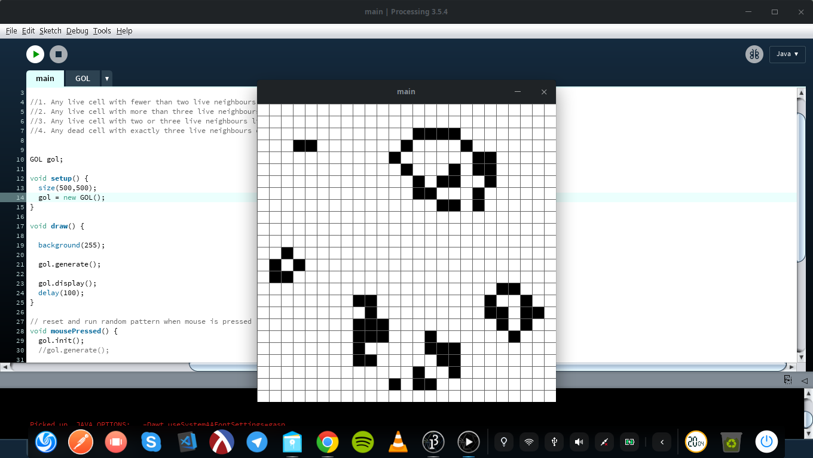

# Conway's Game Of Life

## Getting Started
you need to install [processing](https://processing.org/) (java) to run the Game of Life

## Rules of the game
  - Any live cell with fewer than two live neighbours dies, as if by loneliness.
  - Any live cell with more than three live neighbours dies, as if by overcrowding.
  - Any live cell with two or three live neighbours lives, unchanged, to the next generation.
  - Any dead cell with exactly three live neighbours comes to life.
## Preview
 

## Instructions
  - first it will run a random predefined pattern
  - mousclick on anywhere on the screen will initialize the random board to evaluate with the 4 rules.
## Reference Articals
  - [The fantastic combinations of John Conway's new solitaire game "life".](http://www.ibiblio.org/lifepatterns/october1970.html)
  -[Wiki](https://en.wikipedia.org/wiki/Conway%27s_Game_of_Life)
  -
